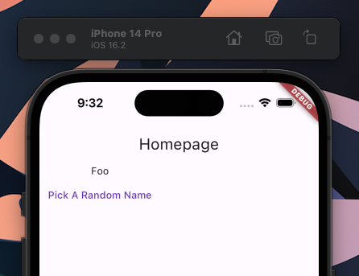

# cubit

Simple project where I create a flutter homepage snippet (code below), create a NameCubit and implement in my HomePage.

## To create a Flutter homepage snippet:

1. Create a new flutter project using `flutter create "name_of_your_project"` and open your project
2. In VSCode use `Command + Shift + P` and then choose `Snippets: Configure User Snippets`
3. Choose a name, I chose `flutter` but if you already have a snippets file - why are you reading this? :D
4. Past the following code:

```js
{
	"Homepage Flutter Snippet": {
		"scope": "dart",
		"body": [
"import 'package:flutter/material.dart';",
"",
"void main() {",
"  runApp(const MyApp());",
"}",
"",
"class MyApp extends StatelessWidget {",
"  const MyApp({super.key});",
"",
"  @override",
"  Widget build(BuildContext context) {",
"    return MaterialApp(",
"      title: 'Flutter Demo',",
"      theme: ThemeData(",
"        colorScheme: ColorScheme.fromSeed(seedColor: Colors.deepPurple),",
"        useMaterial3: true,",
"      ),",
"      home: const MyHomePage(),",
"    );",
"  }",
"}",
"",
"class MyHomePage extends StatelessWidget {",
"  const MyHomePage({super.key});",
"",
"  @override",
"  Widget build(BuildContext context) {",
"    return Scaffold(",
"      appBar: AppBar(title: const Text('Homepage')),",
"    );",
"  }",
"}",

		],
		"prefix": "fluthome"
	}
}
```

5. Go to your `main.dart`

## To build a basic cubit

### What is a cubit?

It is the native abstract clas behind the Bloc library. A Cubit is similar to Bloc but has no notion of events and relies on methods to emit new states. Every Cubit requires an initial state which will be the state of the Cubit before emit has been called. The current state of a Cubit can be accessed via the state getter.

I felt like it was important to understand Cubits before I moved on to Bloc and Provider for Flutter.

1. I built a basic iterable of names and an extension on the Iterable class that allows me to get a random name:

```js
const names = ['Foo', 'Bar', 'Baz'];

extension RandomElement<T> on Iterable<T> {
  T getRandomElement() => elementAt(math.Random().nextInt(length));
}
```

2. Create my cubit! I extend the cubit and let it know that the State will be a nullable String. I then initialise my Cubit with a null value. I then give it a `pickRandomName` method that emits (which is a must for state in cubits) the state: in this case a new String name.

```js
class NamesCubit extends Cubit<String?> {
  NamesCubit() : super(null);

  void pickRandomName() => emit(names.getRandomElement());
}
```

3. Make my HomePage stateful so that I can hold and emit state within it (you can move your cursor over the function itself and in VSCode use the `Command + .` to allow Flutters extension to convert it to a stateful widget for you! Once I have made this conversion I update my homepage to initialise

```js
class _MyHomePageState extends State<MyHomePage> {
  late final NamesCubit cubit;

  @override
  void initState() {
    super.initState();
    cubit = NamesCubit();
  }

  @override
  void dispose() {
    cubit.close();
    super.dispose();
  }

  @override
  Widget build(BuildContext context) {
    return Scaffold(
      appBar: AppBar(title: const Text('Homepage')),
      body: StreamBuilder<String?>(
          stream: cubit.stream,
          builder: (context, snapshot) {
            final button = TextButton(
              onPressed: () => cubit.pickRandomName(),
              child: const Text('Pick A Random Name'),
            );
            switch (snapshot.connectionState) {
              case ConnectionState.none:
                return button;
              case ConnectionState.waiting:
                return button;
              case ConnectionState.active:
                return Column(
                  children: [Text(snapshot.data ?? ''), button],
                );
              case ConnectionState.done:
                return const SizedBox();
            }
          }),
    );
  }
}

```

## Example Cubit 


